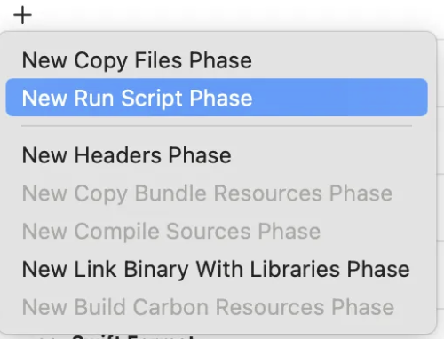
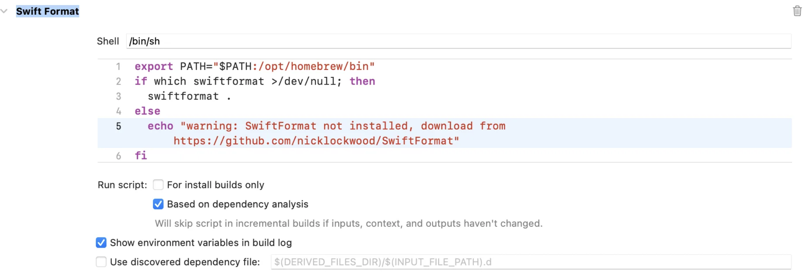

# Oculab Project

## Overview

Oculab is an iOS application designed to enhance Tuberculosis (TB) microscopic examination through AI-powered analysis, addressing the challenges of accuracy and delays in TB grading, where traditional microscopy remains slow and error-prone.. This README outlines the setup instructions necessary for team members to get started with the project.

## Prerequisites

Before you start, ensure you have the following installed:

- **Xcode**: Download and install Xcode from the [Mac App Store](https://apps.apple.com/us/app/xcode/id497799835?mt=12).
- **Homebrew**: If you haven’t installed Homebrew yet, follow the instructions on [brew.sh](https://brew.sh/) to get it set up.

## Installation

### 1. Install XcodeGen

XcodeGen is a command-line utility that creates Xcode project files from a YAML or JSON configuration.

To install XcodeGen, open your terminal and execute the following command:

```bash
brew install xcodegen
```

### 2. Install SwiftFormat

SwiftFormat is a tool that helps format Swift code based on specified rules.

To install SwiftFormat, run this command in your terminal:

```bash
brew install swiftformat
```

### 3. Clone the Repository

Clone the Oculab repository to your local machine using the following command:

```bash
git clone https://github.com/indrikla/Oculab-FE.git
```

### 4. Generate the Xcode Project

Navigate to the project directory and generate the Xcode project using XcodeGen:

```bash
cd /navigate/to/our/project
xcodegen
```

If you have just pulled from another branch, you can simply run:

```bash
xcodegen
```

### 5. Setting up SwiftFormat

To automatically format your code with SwiftFormat, you can set up a script that runs every time you build the project.
Go to xcode → Select project targets → Build phases → Add ‘new run script phase’



Rename the script and fill the script with this prompt:


```bash
export PATH="$PATH:/opt/homebrew/bin"
if which swiftformat >/dev/null; then
  swiftformat .
else
  echo "warning: SwiftFormat not installed, download from https://github.com/nicklockwood/SwiftFormat"
fi
```

## GIT Agreement

To ensure a smooth and effective collaboration within our team, please adhere to the following guidelines regarding Git usage:

### 1. Branch Naming Conventions:

• Main Branch (main): This is the primary branch that contains production-ready code. Do not make direct edits to this branch.
• Development Branch (development): This branch is used for integrating new features. Always pull your latest changes from this branch.
• Feature Branches (feature/): Create branches for new features with descriptive names.
• Example: feature/user-authentication, feature/payment-integration
• Release Branches (release/): For preparing new releases, use the format release/vX.X.
• Example: release/v1.0, release/v2.0
• Hotfix Branches (hotfix/): Used for critical fixes in the production version, following the format hotfix/issue-description.
• Example: hotfix/fix-login-bug

### 2. Review Process:

• Pull Requests: Always create a pull request (PR) from your feature branch to the Development branch.
• Tagging Reviewers: When creating a PR, tag @indrikla as a reviewer to ensure prompt feedback.
• Approval Requirement: PRs must be reviewed and approved by at least one team member before merging into the Development branch.

### 3. Commit Messages:

• Use clear and descriptive commit messages. The recommended format is:

```bash
[Commit Type]: Short description
```

• Commit Types:

```bash
- feat: For new features
- fix: For bug fixes
- docs: For documentation updates
- style: For formatting changes (non-functional)
- refactor: For code changes that do not add features or fix bugs
- test: For adding or updating tests
- chore: For routine tasks
```

### 4. General Guidelines

Always keep your branches up to date by pulling changes from Development regularly.

For more detailed rules and processes, please refer to the full Git SOP [here](https://www.notion.so/4c2447f8c0564260bf12f8d324edf938?pvs=25#f081444c9f024000981e31090903b615).

## Code Guidelines

To foster a collaborative and efficient development environment in the Oculab project, please adhere to the following code guidelines:

### 📖 Readability

- **Clear Code, Happy Developers**: Strive to write code that is easy to read and understand. The more readable the code, the quicker it can be modified and extended.
- **Address Warnings**: Always clean up any compiler warnings before committing. A clean build ensures smoother integration and fewer surprises down the line.
- **Use Comments Wisely**: Comments should clarify complex logic, not restate the obvious. Aim for self-explanatory code that minimizes the need for comments. Remember: _“Code is read more often than it is written.”_

### 🧹 Cleanliness

- **Eliminate Unused Code**: Regularly clean up unused variables, functions, or imports. Keeping the codebase tidy helps maintain focus and efficiency.
- **Limit Nesting**: Deeply nested code can be difficult to follow. Aim for a flat structure to enhance clarity and reduce cognitive load. _“Simplicity is the ultimate sophistication.”_

### 🎯 Clarity

- **Descriptive Naming Conventions**: Use meaningful names for variables, functions, and classes. Names should clearly convey their purpose. For example, instead of `func a()`, use `func calculateUserScore()`. _“Good naming can make the difference between confusion and clarity.”_
- **Consistent Folder Structure**: Maintain a logical and consistent folder structure. Group related files together and use clear names for folders. _“A well-organized project is a joy to work on!”_

### 🔧 Maintainability

- **Modular Design**: Break your code into reusable, self-contained modules. This promotes easier testing and maintenance. _“Think modular for a future-proof codebase!”_
- **Adhere to Design Patterns**: Use established design patterns relevant to your project. This promotes consistency and improves code maintainability. _“Good patterns lead to good practices!”_

### 🛡️ Security

- **Sanitize Inputs**: Always validate and sanitize inputs to prevent security vulnerabilities. Remember, _“Security is not an option; it’s a necessity!”_
- **Avoid Hardcoding Sensitive Data**: Never hardcode API keys or sensitive information. Use environment variables or configuration files instead. _“Keep your secrets safe!”_

### 🤝 Collaboration

- **Peer Reviews**: Encourage code reviews before merging. Fresh perspectives can spot potential issues and improve code quality. _“Together we build better code!”_
- **Tagging Reviewers**: When submitting pull requests, tag @indrikla as a reviewer to ensure timely feedback. _“Feedback is a gift; use it wisely!”_

### 🌱 Continuous Improvement

- **Refactor Regularly**: Don’t hesitate to improve and refactor existing code. Make small changes regularly to keep the codebase healthy. _“A little improvement every day leads to big results!”_
- **Stay Updated**: Keep abreast of the latest Swift best practices and language features. Continuous learning fosters growth and excellence. _“Every day is a chance to learn something new!”_